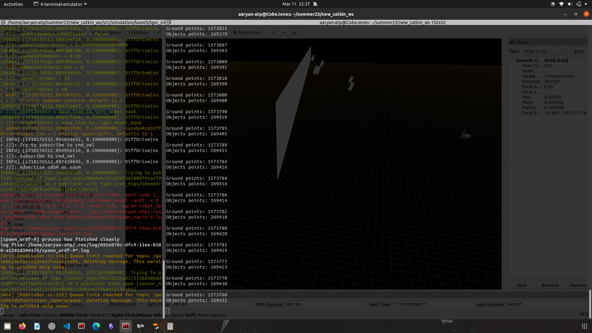
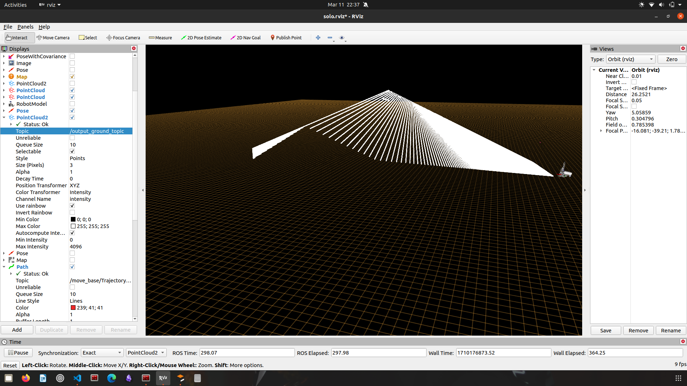
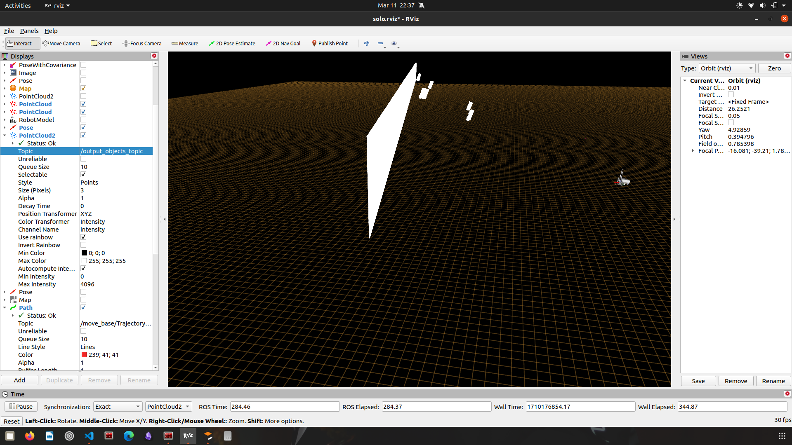

This is a ROS package that does ground-plane segmentation and obstacle detection from a 3D point cloud using the point cloud library (PCL). 

## Example Run
You can run the package given you have a point cloud file being published to a topic (as defined in at the top of the ground_plane_seg.cpp file) in a ROS environment. 

The Gorund - 

The Obstacles -

